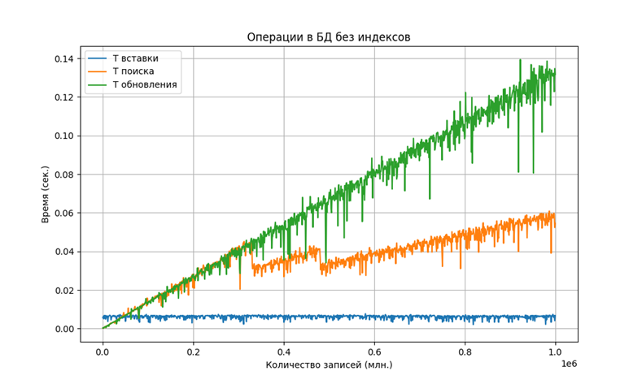
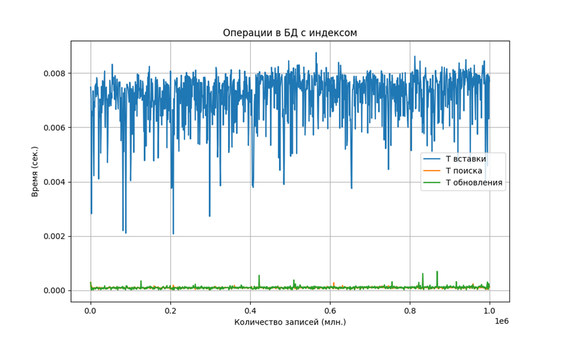
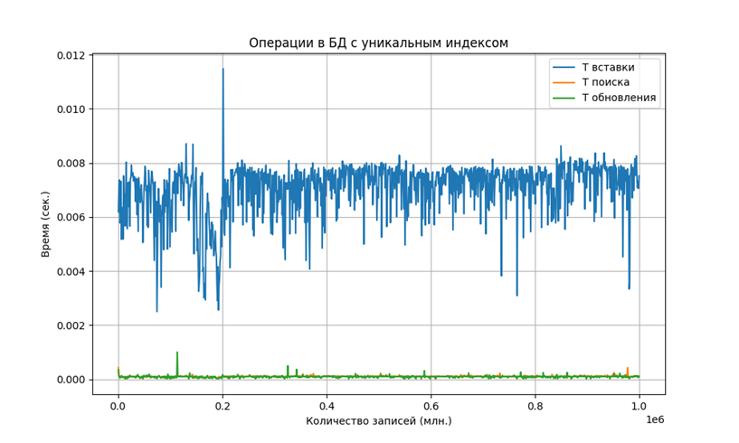

# DB_indexes_tests

Проект, в котором исследуется работа различных типов ускорения запросов в базах данных.
- Тестирование работы индексов в базах данных, тестирование рабоыт 
кластеризации в СУБД PostgreSQL. 
- Тестирование работы СУБД ClickHouse.

## 1. Объем данных в БД 
В данной части было протестровано рост размера хранилища по мере роста 
числа записей в БД.

| N | 0 | 1 | 158 | 315 | 470 | 627 | 784 | 941 | 1098 | 1254 | 1411 | 1570 | 1727 | 1884 | 2041 | 2198 | 2355 | 2512 |
|---|---|---|-----|-----|-----|-----|-----|-----|------|------|------|------|------|------|------|------|------|------|
| Размер | 8192 | 16384 | 24576 | 32768 | 40960 | 49152 | 57344 | 65536 | 73728 | 81920 | 90112 | 98304 | 106496 | 114688 | 122880 | 131072 | 139264 | 147456 |

Исходя из таблицы, было посчитано, что на одной странице содержалось 157 записей, следовательно, одна запись занимает 8192/157 = 52,1 байт.

---
## 2. Тестирование секционировнаия
В даннйо части для 1000000 рандомных записей, поделенных на 8 секций была исследована скорость 
обращения к секционированным данным в отличие от несекционированных.

| Без секционирования |                |                |                |
|-------------------------------------|----------------|----------------|----------------|
|                                    | 3 секция       | 6 секция       | 3 и 6 секция   |
| Результат 1                         | 0.075          | 0.073          | 0.054          |
| Результат 2                         | 0.052          | 0.052          | 0.061          |
| Результат 3                         | 0.057          | 0.054          | 0.063          |
| Результат 4                         | 0.110          | 0.049          | 0.063          |
| Результат 5                         | 0.053          | 0.051          | 0.065          |
| Среднее значение                    | 0.069          | 0.055          | 0.061          |

| С секционированием |                |                |                |
|-----------------------------------|----------------|----------------|----------------|
|                                  | 3 секция       | 6 секция       | 3 и 6 секция   |
| Результат 1                       | 0.013          | 0.015          | 0.030          |
| Результат 2                       | 0.016          | 0.015          | 0.026          |
| Результат 3                       | 0.016          | 0.011          | 0.026          |
| Результат 4                       | 0.010          | 0.007          | 0.025          |
| Результат 5                       | 0.015          | 0.014          | 0.019          |
| Среднее значение                  | 0.0014         | 0.012          | 0.025          |

 Из таблиц видно, что запросы к секционированной таблице выполняются в несколько раз быстрее.

---
## 3. Исследование различных типов индексов
В данной части по мере роста числа записей с шагом 1000 до 1000000 были протестированы скорости
записи, поиска и обновления данных. Результаты были визуализированы через скрипт на Python.

---
### 4. Исследование ClickHouse
В данной части БД ClickHouse была заполнена 1000000 записей и произведены тесты.